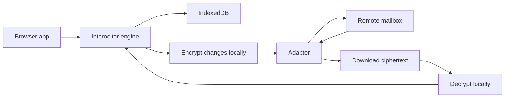

<p align="center">
  <a href="https://github.com/TheUiTeam/interocitor">
    
  </a>
</p>

<p align="center">
  <strong>The JavaScript mailbox that can't read your mail.</strong>
</p>

# interocitor

Encrypted local-first CRDT sync for browser apps.

## Why

You need a mailbox that can't read your mail.

Interocitor is **privacy-first, local-second**.

There are excellent local-first sync solutions. If you need real-time collaboration, rich queries, or operational transforms — use them. They will outperform Interocitor on almost every axis:

| If you need | Use |
| --- | --- |
| Real-time multiplayer | [Logux](https://logux.org/), [Automerge](https://automerge.org/), [Yjs](https://yjs.dev/) |
| Postgres ↔ local sync | [ElectricSQL](https://electric-sql.com/), [PowerSync](https://www.powersync.com/), [Zero](https://zero.rocicorp.dev/) |
| Full-stack local-first DB | [Triplit](https://www.triplit.dev/), [Dexie Cloud](https://dexie.org/cloud/) |
| Managed backend with offline | [Firebase](https://firebase.google.com/), [Supabase](https://supabase.com/), [Convex](https://www.convex.dev/) |
| Reactive local store | [TinyBase](https://tinybase.org/) |

Interocitor exists for a narrower problem: keep sync compatible with true client-side encryption.

Most sync systems need the server to understand your data so it can merge, query, or partially replicate it. Once the server needs to understand the data, the server needs plaintext. That makes end-to-end encryption a feature layered around sync, not a property of sync itself.

Interocitor takes the opposite approach. Merge happens on the client. Querying happens on the client. Conflict resolution happens on the client. The remote system is just a byte pipe. That means you can encrypt before upload and still sync successfully because the transport was never expected to interpret the payload.

Trade-offs:

- No server-side queries
- No partial sync
- Full dataset replicated to every participating device

Benefits:

- **True end-to-end encryption**
- **Offline-native reads and writes**
- **No purpose-built sync backend required**
- **Transport-agnostic adapters**

## Installation

```bash
yarn add interocitor
```

## Quick start

```ts
import { Interocitor } from 'interocitor';
import { WebDAVAdapter } from 'interocitor/adapters/webdav';

const engine = new Interocitor({
  dbName: 'todos',
  schema: {
    todos: {
      indexes: ['done', 'createdAt']
    }
  },
  adapter: new WebDAVAdapter({
    baseUrl: 'http://127.0.0.1:8789',
    remotePath: '/demo-room'
  }),
  encryption: {
    passphrase: 'correct horse battery staple'
  }
});

await engine.init();

await engine.put('todos', {
  id: 'todo-1',
  text: 'Write encrypted sync docs',
  done: false,
  createdAt: Date.now()
});

await engine.sync();
const rows = await engine.query('todos');
```

## How sync works

<p align="center">
  
</p>



## Core API at a glance

- `await engine.init()`
- `await engine.put(table, row)`
- `await engine.delete(table, id)`
- `await engine.get(table, id)`
- `await engine.query(table, options?)`
- `await engine.sync()`
- `engine.on('change', handler)`

## Offline guarantee

| Operation | Network? | Backing store |
| --- | --- | --- |
| `init()` | No | IndexedDB |
| `put()` | No | IndexedDB |
| `delete()` | No | IndexedDB |
| `get()` / `query()` | No | IndexedDB |
| `sync()` | Yes, if adapter configured | Remote mailbox |

## Adapters

### Google Drive

For zero new backend infrastructure where Google Drive is acceptable as the encrypted mailbox.

### WebDAV

For self-hosted sync, local demos, and inspectable remote artifacts.

### Cloudflare (experimental)

For Interocitor-native transport flows with invalidation fanout and maintenance endpoints while keeping decryption client-side.

### Memory

For tests and adapter-contract validation.

## Encryption

Interocitor is built around client-side encryption rather than retrofitting it later.

```ts
const engine = new Interocitor({
  dbName: 'secure-db',
  schema,
  encryption: {
    passphrase: 'correct horse battery staple'
  }
});
```

### Client-side fingerprint verification

Expose a human-verifiable fingerprint in your UI if you want users to confirm that multiple devices joined the same encrypted dataset.

## CRDT strategy

Interocitor uses a client-side CRDT strategy with hybrid logical clocks. Remote storage is only a transport and artifact exchange layer.

## Events

```ts
engine.on('change', (event) => {
  console.log(event.type, event.table, event.id);
});
```

## Cloud folder layout

```text
<remotePath>/
  snapshot.meta
  changes/
    0000000001.json
    0000000002.json
  blobs/
    ...encrypted payloads...
```

## Local TODO demo (WebDAV)

From the monorepo root:

```bash
yarn demo:todo
```

## What this is not

- **Not a multiplayer backend**
- **Not server-queryable storage**
- **Not partial sync**
- **Not useful if your server must understand your data**

## Tests

From the monorepo root:

```bash
yarn build
yarn test:e2e
yarn test:e2e:todo
```

## Package context

- Monorepo root: <https://github.com/TheUiTeam/interocitor>
- Package home: <https://github.com/TheUiTeam/interocitor/tree/main/packages/interocitor>
- WebDAV demo: <https://github.com/TheUiTeam/interocitor/tree/main/examples/todo-webdav>
- Cloudflare example: <https://github.com/TheUiTeam/interocitor/tree/main/examples/todo-cloudflare-do>

## License

MIT
